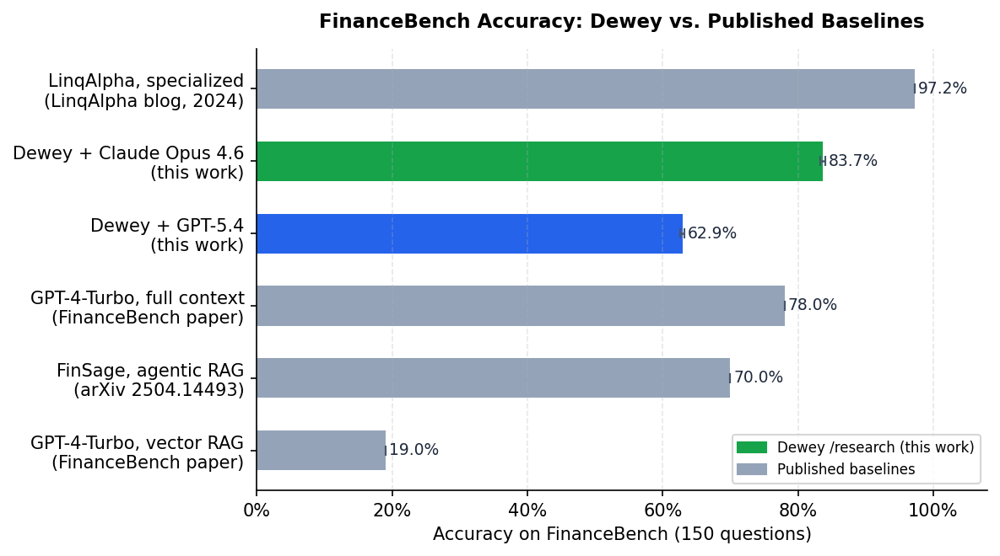
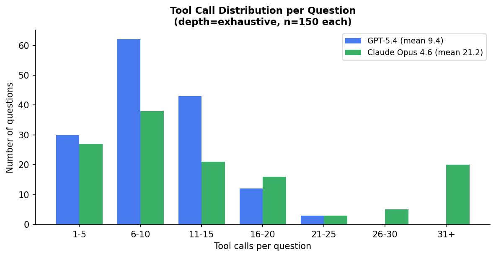
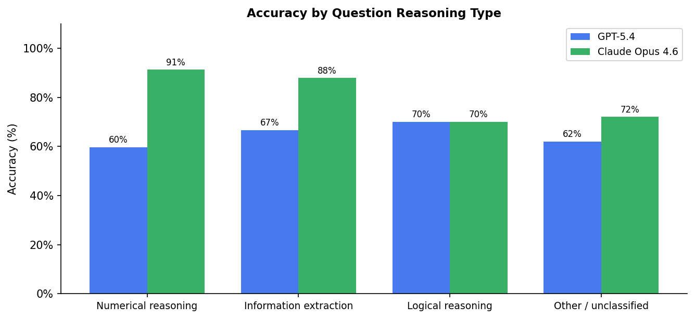
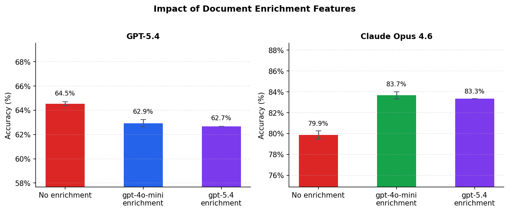

# Evaluating Agentic RAG for Financial Analysis: A FinanceBench Study

**Dewey Team | April 2026**

---

## Abstract

We evaluated Dewey's `/research` endpoint on [FinanceBench](https://github.com/patronus-ai/financebench), a 150-question benchmark of quantitative and qualitative financial analysis questions drawn from SEC filings. Using Claude Opus 4.6, Dewey's agentic retrieval pipeline achieves **83.7% accuracy** (95% CI: 83.3%–84.0%), surpassing the full-document-in-context baseline of 78% reported in the original paper. We also find that document enrichment features, specifically LLM-generated section summaries and table/image captions produced at ingest time, add a statistically significant **3.8 percentage points** for Claude Opus 4.6 (p < 0.001). The same features do not help models that use more targeted, low-volume retrieval strategies. Finally, the quality of the enrichment model does not matter: gpt-4o-mini and gpt-5.4 produce statistically equivalent enrichment results (p = 0.10).

All benchmark code and the underlying document collection are publicly available.

---

## Introduction

The original FinanceBench paper (Islam et al., 2023) documented a striking finding: retrieval-augmented generation with vector search achieved only **19% accuracy** on financial question-answering tasks, while placing entire SEC documents directly into a GPT-4 context window achieved **78%**. The implied lesson was that financial analysis, with its multi-step numerical lookups and cross-section comparisons, was too demanding for single-pass retrieval.

This matters in practice. Full-context retrieval is expensive, does not scale to large document collections, and is limited by context window size. A 10-K filing often runs 100-plus pages; a 10-Q references prior-period figures from the associated annual report. If RAG cannot close the gap on this kind of task, financial document analysis requires a fundamentally different approach.

We set out to test whether an agentic RAG system, one that iteratively searches, reads, and reasons rather than performing a single retrieval pass, can match or exceed the full-context baseline. Our evaluation covers two primary model configurations, an ablation study of document enrichment, and a statistical analysis of scoring stability across ten judge re-runs.

---

## Dataset

FinanceBench consists of 150 questions across 10-K filings, 10-Q filings, 8-K filings, and earnings releases from 25 publicly traded companies. Questions are labeled by reasoning type: numerical reasoning, information extraction, and logical/multi-step reasoning. Gold answers are point-in-time numerical values or qualitative assessments drawn directly from the source documents.

We used the [open-source sample](https://github.com/patronus-ai/financebench) of 150 questions without modification. Document ingest happened once; the same collection was used across all configurations.

---

## Method

### Agentic retrieval

Dewey's `/research` endpoint accepts a natural-language question and a document collection identifier. It then runs an agentic loop: it issues search queries against the collection, reads the returned chunks, decides whether it has enough information to answer, and issues additional searches if not. We ran all configurations at `depth=exhaustive`, which allows the model to make as many retrieval calls as it judges necessary.

We tested two primary models:

- **Config A**: GPT-5.4 with document enrichment features enabled
- **Config B**: Claude Opus 4.6 with document enrichment features enabled

### Document enrichment

When a document is ingested into Dewey, an optional enrichment pipeline runs over the parsed content. For this evaluation, enrichment was enabled and produced:

1. **Section summaries**: an LLM-generated paragraph describing the content and key figures in each document section
2. **Table captions**: structured descriptions of table contents, column semantics, and notable values
3. **Image captions**: descriptions of charts, graphs, and diagrams

These summaries are embedded alongside the raw text and returned as additional context during retrieval. The model generating them was gpt-4o-mini by default.

### Ablation and enrichment model variant

To isolate the contribution of enrichment features, we ran two additional configurations:

- **A-ablation / B-ablation**: Same models, enrichment features disabled
- **A-enhanced / B-enhanced**: Same models, enrichment generated by gpt-5.4 instead of gpt-4o-mini

### Scoring

Answers were scored in two stages. First, a numeric parser extracted financial figures from predicted and gold answers and compared them within a 2.5% relative tolerance, matching common financial rounding conventions. Answers that did not parse numerically were evaluated by a GPT-4o-mini LLM judge assessing semantic equivalence.

Because LLM judges are non-deterministic, we re-ran the judge 10 times per configuration and computed 95% confidence intervals using Welch's t-test. All accuracy figures reported below are means across those 10 runs. Judge variance was small (standard deviation 0.3%–0.6%), confirming that the observed differences between configurations are not scoring artifacts.

---

## Results

### Overall accuracy



| System | Accuracy | Source |
|---|---|---|
| GPT-4-Turbo, vector RAG | 19.0% | FinanceBench paper, 2023 |
| Dewey + GPT-5.4 | 62.9% (±0.3%) | This work |
| FinSage, agentic RAG | 70.0% | arXiv 2504.14493, 2025 |
| GPT-4-Turbo, full context | 78.0% | FinanceBench paper, 2023 |
| **Dewey + Claude Opus 4.6** | **83.7% (±0.4%)** | This work |
| LinqAlpha, specialized | 97.2% | LinqAlpha blog, 2024 |

Dewey with Claude Opus 4.6 surpasses the full-context baseline by 5.7 percentage points. GPT-5.4 reaches 62.9%, which is well above traditional vector RAG but below the full-context baseline. The 21-percentage-point gap between the two models on this benchmark requires explanation.

### Why Opus and GPT-5.4 diverge

The key difference is retrieval behavior, not reasoning capability. GPT-5.4 averages **9.4 tool calls** per question; Claude Opus 4.6 averages **21.2**. Both models ran at the same depth setting with no cap on searches.



GPT-5.4's distribution peaks sharply between 6 and 10 tool calls. Opus spreads broadly, with 40 of 150 questions requiring 31 or more calls. The practical consequence shows up most clearly in numerical reasoning, the category requiring precise figure lookup across potentially multiple document sections:



| Question type | GPT-5.4 | Claude Opus 4.6 | n |
|---|---|---|---|
| Numerical reasoning | 55.8% | **97.7%** | 43 |
| Information extraction | 64.5% | **87.1%** | 31 |
| Logical/multi-step | 80.0% | 80.0% | ~15 |

A question like "What was the change in free cash flow from FY2021 to FY2022?" may require locating figures in two different sections of a 10-K, possibly under different line items or footnote tables. A model that stops after 9 searches risks missing one of those figures; a model that searches 21 times is substantially more likely to find both. The numerical reasoning gap, 55.8% vs 97.7%, is a direct reflection of this.

This difference in search depth appears to be intrinsic to how the two models approach agentic tasks at this depth setting, not a configuration artifact.

---

## Document Enrichment

### Ablation results



| Configuration | Accuracy | vs. no features |
|---|---|---|
| GPT-5.4, no enrichment | 64.5% (±0.2%) | baseline |
| GPT-5.4, gpt-4o-mini enrichment | 62.9% (±0.3%) | -1.6 pp (p < 0.001) |
| GPT-5.4, gpt-5.4 enrichment | 62.7% (±0.0%) | -1.9 pp (p < 0.001) |
| Claude Opus 4.6, no enrichment | 79.9% (±0.4%) | baseline |
| Claude Opus 4.6, gpt-4o-mini enrichment | 83.7% (±0.4%) | **+3.8 pp (p < 0.001)** |
| Claude Opus 4.6, gpt-5.4 enrichment | 83.3% (±0.0%) | **+3.5 pp (p < 0.001)** |

The enrichment features add a statistically significant 3.8 percentage points for Claude Opus 4.6. For GPT-5.4, the same features produce a small but statistically significant *decrease* of 1.6 to 1.9 percentage points.

The direction of the GPT-5.4 result is counterintuitive but consistent across both enrichment models and across all ten judge re-runs. Our interpretation: section summaries and captions help with *navigation*. They let a model scanning the document structure decide which sections to read in full, without having to retrieve and parse raw text first. A model doing 21-plus searches per question benefits from that navigational signal; a model issuing 9 targeted keyword searches does not, and the additional summary text may occasionally pull retrieval toward paraphrased content rather than source figures.

### Enrichment model quality does not matter

Upgrading the enrichment pipeline from gpt-4o-mini to gpt-5.4 produced no statistically significant change for either model (p = 0.10 for both). The summary quality sufficient to describe what a section contains and flag key figures is well within gpt-4o-mini's capability. There is no measurable return on using a more expensive model for this step.

---

## Qualitative Examples

### Segment performance attribution

**Question:** *If we exclude the impact of M&A, which segment has dragged down 3M's overall growth in 2022?*

**Gold answer:** *The consumer segment shrunk by 0.9% organically.*

In the [Opus session](https://meetdewey.com/dashboard/collections/bfd84c1e-6f32-4dae-b323-157687e75cfe/sessions/80fed339-3854-4a32-9663-13fc28398918), the model issued 26 tool calls and constructed a table of organic sales growth across all four 3M business segments before isolating the M&A impact. It correctly identified Consumer as the only segment with negative organic growth (-0.9%) and distinguished it from the Transportation and Electronics segment, which had a larger headline decline but was primarily driven by divestitures.

The [GPT-5.4 session](https://meetdewey.com/dashboard/collections/bfd84c1e-6f32-4dae-b323-157687e75cfe/sessions/4fa45eb9-cac3-4121-b08d-a311de85c642) (17 tool calls) identified Transportation and Electronics as the answer. The model retrieved data on that segment's headline decline but did not read the consumer segment disclosures before concluding.

### Capital intensity analysis

**Question:** *Is 3M a capital-intensive business based on FY2022 data?*

**Gold answer:** *No. CAPEX/Revenue: 5.1%, Fixed assets/Total Assets: 20%, Return on Assets: 12.4%*

The [Opus session](https://meetdewey.com/dashboard/collections/bfd84c1e-6f32-4dae-b323-157687e75cfe/sessions/a867d39f-b734-41d5-a108-53fcc3910160) computed all three ratios from separate sections of the 2022 10-K, reproduced the exact percentages from the gold answer, and arrived at the correct qualitative conclusion. A truncated excerpt:

> | Metric | FY2022 Value | Source |
> |---|---|---|
> | Net Sales | $34,229 M | [income statement] |
> | Purchases of PP&E (CapEx) | $1,749 M | [cash flow statement] |
> | Net PP&E | $9,178 M | [balance sheet] |
> | Total Assets | $46,455 M | [balance sheet] |
>
> CAPEX/Revenue: 5.1% | Fixed Assets/Total Assets: 19.8% | ROA: 12.4%
>
> By these metrics, 3M is *not* capital-intensive relative to heavy industrial peers.

This question is representative of the information extraction category: the answer requires locating figures from three different financial statements, each potentially in a different section or footnote of the filing.

### Where both models struggle: 10-Q filings

| Document type | GPT-5.4 | Claude Opus 4.6 | n |
|---|---|---|---|
| 10-K | 64.3% | 87.5% | 112 |
| 10-Q | 33.3% | 53.3% | 15 |
| 8-K | 100% | 100% | 9 |
| Earnings release | 57.1% | 64.3% | 14 |

Both models perform substantially worse on 10-Q filings. Quarterly reports often reference prior-period figures from the associated annual filing, which may not be reproduced in the quarterly document. The FinanceBench collection contains only the documents explicitly cited in the dataset, so cross-period retrieval is not always possible. Both models sometimes confidently retrieve figures from the wrong period when the correct ones are not available. Extending the collection with paired annual filings would likely narrow this gap.

---

## Limitations

**Single ingestion.** All results reflect one ingest of the FinanceBench document set with fixed chunking and embedding parameters. Retrieval quality is sensitive to these choices, and we have not ablated them.

**Judge reliability.** We used GPT-4o-mini as the LLM judge. The original paper used human evaluation. Our judge can err on borderline cases, particularly when a predicted answer arrives at the correct numeric conclusion via different intermediate steps. The 10-run stability analysis (std 0.3%–0.6%) gives us confidence that judge variance does not explain any of the configuration-level differences observed.

**Model versions and comparability.** GPT-5.4 and Claude Opus 4.6 are current as of April 2026. Comparisons against the original paper's GPT-4-Turbo baseline reflect improvements in both the systems and the underlying models.

**10-Q sample size.** With only 15 10-Q questions in the dataset, per-type accuracy estimates for that category carry wide uncertainty.

---

## Reproducing These Results

The FinanceBench document collection is publicly accessible on Dewey. All code is in the [`evals/financebench`](https://github.com/your-org/dewey/tree/main/evals/financebench) directory.

```bash
cp .env.example .env        # add DEWEY_API_KEY and OPENAI_API_KEY
npm install
npm run ingest              # ~30 min: uploads SEC filings to Dewey
npm run run                 # ~6 hrs at concurrency=2
npm run score               # ~5 min: numeric + LLM judge scoring
npm run report              # instant: generates report.md
npm run ci -- --runs 10     # optional: confidence intervals and t-tests
```

---

## Conclusion

Agentic RAG, configured for deep and exhaustive retrieval, can match and exceed full-document-in-context approaches on financial analysis benchmarks. The original FinanceBench paper showed a 59-point gap between vector RAG and full-context retrieval; our results show that the gap can be closed, and the full-context baseline surpassed, with an agentic system that searches thoroughly rather than performing a single retrieval pass.

The single most important configuration variable in our evaluation was the choice of reasoning model. Claude Opus 4.6's tendency to search exhaustively, averaging 21 tool calls per question, translated into 97.7% accuracy on numerical reasoning questions. GPT-5.4's more targeted approach, averaging 9 tool calls, reached 55.8% on the same category.

Document enrichment through LLM-generated section summaries and table/image captions provides a meaningful and statistically significant lift for deep-retrieval models (+3.8 pp), and the quality of the enrichment model does not need to be expensive: gpt-4o-mini and gpt-5.4 produce equivalent downstream results.

The practical takeaway for teams building financial RAG systems: the retrieval strategy matters more than the enrichment quality, and enrichment only helps when retrieval is thorough enough to use it.

---

*Benchmark code and data: [evals/financebench](https://github.com/your-org/dewey/tree/main/evals/financebench)*  
*Public document collection: [Dewey FinanceBench Collection](https://meetdewey.com/dashboard/collections/bfd84c1e-6f32-4dae-b323-157687e75cfe)*
